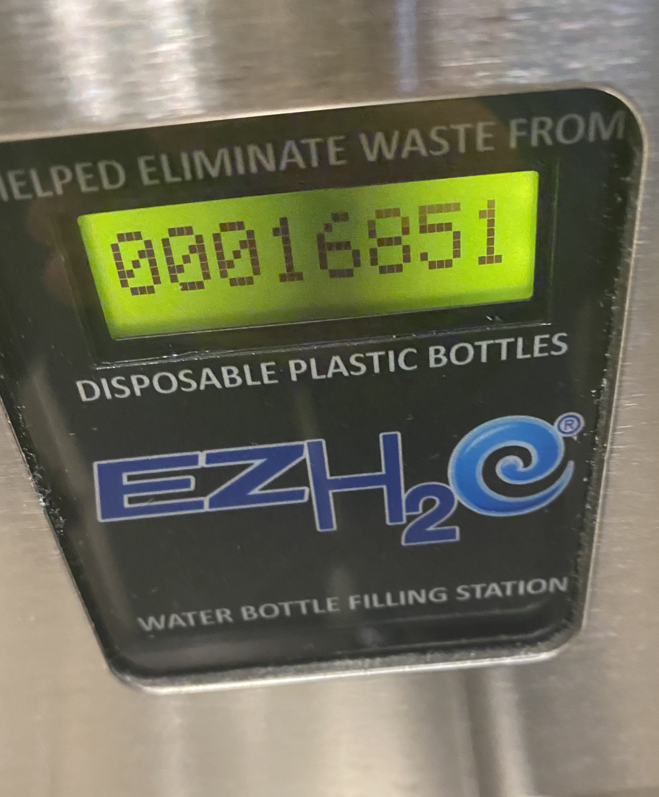

_This winter, I decided to collect data from a water bottle filling station's "bottle counter". The water bottle filling station is located in a residence hall at UC San Diego. While I assume most of the traffic this station sees are residents of UCSD's Revelle College, there is some traffic from nearby lecture halls, gardens, cafeterias and restaurants. Unfortunately, this data collection project was cut short by COVID-19 (following which, I returned home), but I could still find some interesting trends in the limited data I ended up with, so I will write about them here[^1]._

This first graph summarises the bottles since the beginning of data collection (Jan 26):

Looks like a pretty nice and consistent line, but if we look at more fine-grained data, we can see some more interesting properties. This following graph looks at estimated numbers on bottles filled per hour:

Note that the line trace itself is smoothened, but if you hover over the graph, you can see the exact values.

And this connected scatterplot tries to visualise this data in a slightly different way, trying to look for any patterns in water consumption at different times over a day:

The x axis in this chart represents the 24 hour hour of day and the y axis writes about estimates of bottles filler per hour. The most obvious pattern in this, and the previous chart, relate to the unusual spike on February 24th. More on that later. There don't seem to be any other obvious patterns here (there seems to be a slight increase towards the evening/night, but that doesn't seem very statistically significant).

## February 24

It took me a long time to trace the unusual spike on February 24 to a definite event. But this anomaly appears to be the result of the [UCSD 4 COLA](https://www.ucsdcola.net) protests. These protests were part of the larger COLA (Cost of Living Adjustment) strikes [across the UCs](https://payusmoreucsc.com/faq/), and February 24 was a particularly important day for these protests: looking back at [r/UCSD](https://www.reddit.com/r/ucsd), I see lots of posts discussing [large gatherings](https://www.reddit.com/r/UCSD/comments/f6zfhy/what_was_the_protest_about/) and the temporary [closure of the Geisel Library](https://www.reddit.com/r/UCSD/comments/f721q5/what_happened_at_geisel_today/) (the largest library at UCSD). My best explanation for this data anomaly is that students were just out and about a lot more on this day, and this trivial water bottle counter's readings reflect that change in footfall.

I've always found data explorations very exciting due this innate property data tends to have. Data is an unbiased source of truth that doesn't error (or "forget") about things. While the pandemic occupied the collective attention spans of most UCSD students, these protests were just... forgotten? Looking up online, UCSD's student newspapers don't seem to have given these protests enough attention (and of course, the UCSD administration were happy to suppress any discussion about these too).

[^1]: For the curious, [this Observable notebook](https://observablehq.com/@nalinbhardwaj/water-data) contains the raw data (and the code) used to generate these visualisations.