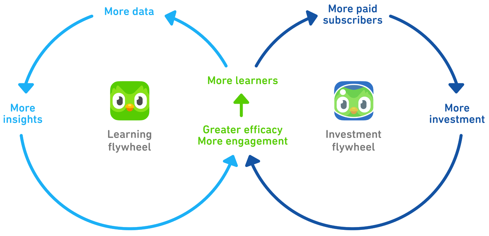
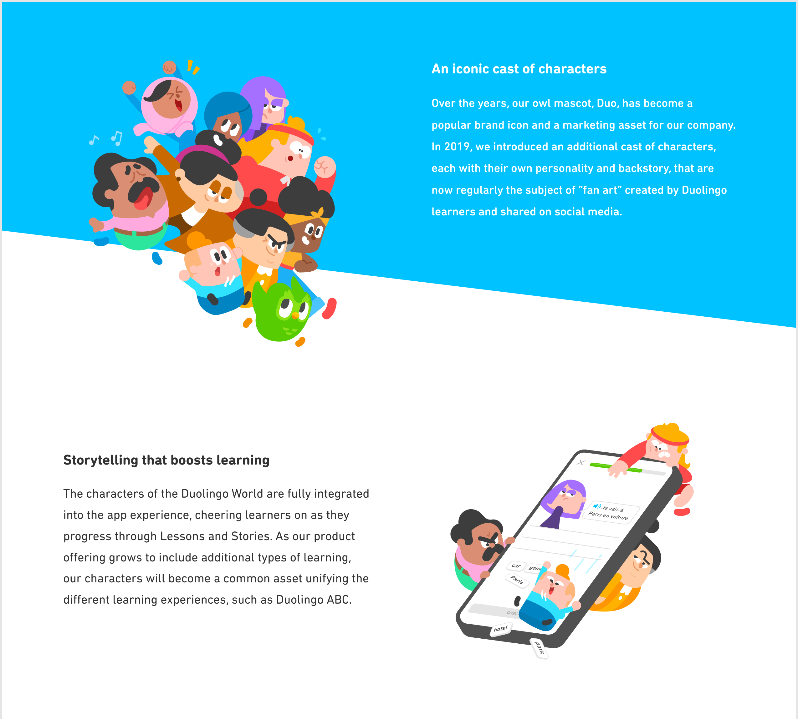
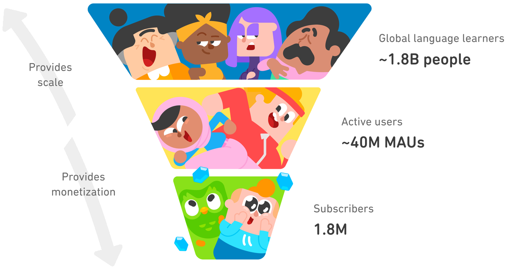
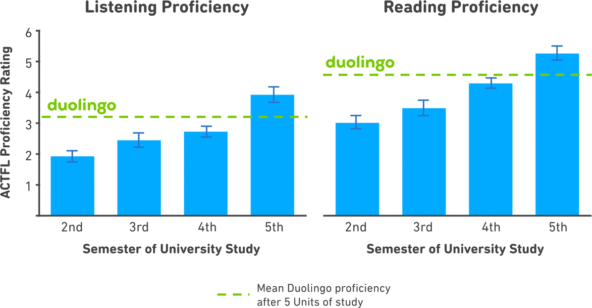
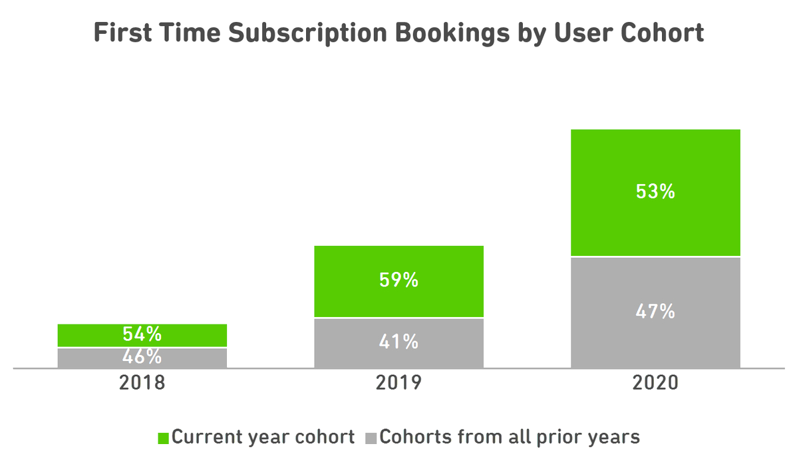
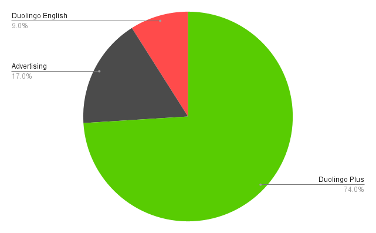

Twitter. Uber. Tinder. Spotify. Coursera. These seemingly unrelated companies all share one common feature: they exist as a layer on top of a marketplace. Their bets are deeply and inherently tied to the dimensions of the underlying marketplaces, whether it's content for reddit, sex for tinder or ride-hailing for Uber[^4]. About 90% of successful "tech" companies are a layer on a marketplace, and the ed-tech category (with its multitudes of marketplaces like Coursera, MasterClass, EdX, and Udemy) is no exception.[^5]

[^5]: Necessary disclaimer that I am not associated with Duolingo in any way. I do not own their stock nor have had any direct relationship with the company in the past. I'm just a fan sharing my thoughts about their product.

[^4]: In the case of Uber's marketplace bet, for instance, the impact of COVID-19 on the marketplace is [apparent :(](https://pluralistic.net/2021/08/10/unter/#bezzle-no-more)

In this bazaar of shopfronts, one company does something interestingly unique: Duolingo. They generate their own content, they define their own platform and they are responsible for their own growth/marketing end-to-end (and they have the cutest mascot ever :]) owning the learner experience end to end. In this post, I'll summarise their S-1, selecting the things I find most interesting and adding some context and commentary to their facts.

# Contents

- [Mission Education](#mission-education)
- [Product](#product)
  * [How to think](#how-to-think)
  * [How to execute](#how-to-execute)
    + [Bets](#bets)
    + [Acts](#acts)
      - [The lesson beats](#the-lesson-beats)
      - [The game beats](#the-game-beats)
      - [The cinematic universe beats](#the-cinematic-universe-beats)
      - [The side story beats](#the-side-story-beats)
    + [Backstage](#backstage)
      - [Machine learning](#machine-learning)
      - [Data Analytics](#data-analytics)
      - [Sales and marketing](#sales-and-marketing)
    + [Climax](#climax)
- [Growth, numbers & all that jazz](#growth-numbers--all-that-jazz)
  * [Key Operating Metrics](#key-operating-metrics)
- [Monetisation](#monetisation)
  * [Monetisation in 2020 & COVID-19](#monetisation-in-2020--covid-19)
- [Future Strategy](#future-strategy)
- [Systems](#systems)
  * [Eng & Product](#eng--product)
  * [Expenses](#expenses)
- [Footnotes](#footnotes)

# Mission Education

Let's start by looking at Duolingo's mission statement, in their words:

> Duolingo believes that everyone, regardless of how wealthy they are, should have access to high quality education. And for the first time in history, the technology necessary to enable this is in the hands of billions of people, in the form of a smartphone. At Duolingo, we build products native to the smartphone—bite-sized, on-demand and engaging — to make learning accessible and effective, opening doors for everyone alike.

Note the interesting prioritization in their mission, while their mobile-first commitment is the centerpiece, language education is not something they choose to fixate on in particular.

The founders' noble motivations and tech-driven problem solving approach seem quite natural if we consider their personal backgrounds:

> Luis and Severin met at Carnegie Mellon University, where Luis was a professor in the Computer Science Department and Severin was his Ph.D. student. Luis, a MacArthur Fellow, grew up in Guatemala and witnessed firsthand the tremendous impact that access to high quality education can have on people’s lives.

Fun fact: Luis von Ahn was also a co-founder at [reCAPTCHA](https://en.wikipedia.org/wiki/ReCAPTCHA) with his own doctoral advisor, [Manuel Blum](https://en.wikipedia.org/wiki/Manuel_Blum) a few years earlier. Seems like he never had to choose between theoretical academia research and industry startups, after all, scraping the best of both worlds between CMU, reCAPTCHA, and Duolingo.

Duolingo has managed to distinguish their product so much from their competitors that while Masterclass and Coursera might have synonymous mission statements to that of Duolingo, Duolingo doesn't even care to name them competitors in their S-1. Funnily enough, the only competitor they directly mention in their "Risk Factors" is Apple:

> ...in 2020, Apple released “Translate," an iOS translation app developed by Apple for iOS devices, to translate text sentences or speech between several languages.

Perhaps, that's what happens when you make your product so unique compared to others in your segment: Duolingo has carved a small monopoly for itself in the niche of auto-generated content when everyone else in the ed-tech industry was busy fighting the perfect competition of marketplaces. [Competition is for Losers](https://youtu.be/3Fx5Q8xGU8k).

# Product

## How to think

Duolingo considers their product with respect to two interesting "flywheel" effects: 

- The learning flywheel: The greater the scale of our learner base, the more we can use insights from data analytics to improve both engagement and efficacy.
- The investment flywheel: Our learner scale and word-of-mouth growth allow us to focus our capital investments on product innovation and data analytics, as opposed to brand or performance marketing.

Their way of thinking relies on growth being a natural side effect of an extremely great product, and while product-led growth is not a natural assumption for all startups, it's certainly the most rewarding model of growth if you can make it work.

## How to execute

### Bets

Every product must select some large overcasting "bets" about the world their product will live in. If building a great product is an exercise in predicting the future, these bets are the tools we employ to pull the future into the present. Duolingo's biggest bets, as they describe, are:

- **A mobile-first world**: Consumers are increasingly gravitating to mobile, app-based experiences, and Duolingo aims to own the mobile experience from the get-go.
- **Fun, effective, free**: Education in future will feel more like games than lessons. Education industry has historically lagged behind other industries, and Duolingo will exploit this to establish their moat: They will use high quality storytelling and strong gamification features to make free game-like educational apps, and use strong technical data analytics and personalization to make their lessons extremely effective.[^1]

[^1]: For completeness, I'll also note the future-facing bet they mention, "We also have a significant opportunity to impact more learners around the world by extending our platform beyond language learning."

Now that we've established the basis for the story Duolingo is writing, let's look at their screenplay itself: the product they've executed thus far.

### Acts

There are many dimensions (acts) to any product (screenplay), so let's break down the beats of Duolingo's product on all these dimensions (acts) independently:

#### The lesson beats

They use 4 beats to enunciate their lessons: skills, levels, lessons, and tips

> Each **Skill** introduces new vocabulary, grammar concepts, and linguistic constructs.

> Each Skill is divided into five **Levels**, and each Level provides learners practice on the same content, but with progressively more challenging exercises.

> Each Level consists of a number of engaging, bite-sized **Lessons** that implicitly teach the vocabulary and linguistic concepts associated with that Skill.

> **Tips** are short text explanations designed to explicitly teach the concepts that might be hard to grasp when introduced implicitly in Lessons.

#### The game beats

They gamify their product using many different mechanisms traditionally seen in video games: experience points, streaks, collectibles, and leaderboards. They break down their gamification features as follows:

> **XP**: Learners earn Experience Points, or “XP,” for completing learning activities in Duolingo.

> **Streaks**: A streak represents the number of days in a row that a learner has used Duolingo, and appears as a flame icon in the app.

> **Crowns**: Learners collect crowns upon completion of a Level of a Skill. Accumulating a certain number of crowns unlocks additional features.

> **Gems**: Gems are the Duolingo virtual currency, which rewards learners for accomplishments like leveling up a Skill. This currency allows learners to buy virtual items from our “Shop”.

> **Leaderboards**: Leaderboards are weekly cohorts of 30 learners who compete to earn the most XP. Leaderboards are organized into Leagues based on the volume of XP earned, starting with the Bronze league, and ending with the Diamond league for the highest XP earners. Each week, the top 10 learners in each Leaderboard advance to the next League. Learners can track their Leaderboard progress daily and are motivated to accumulate XP to earn a place in the top 10.

> **Hearts**: Hearts ensure that learners are mastering content as they progress through a course. Learners start each day with five Hearts, and then lose a heart for each exercise completed incorrectly.

#### The cinematic universe beats

Reacting to the original memes and fan art about their adorable owl mascot Duo, Duolingo picked up on the idea of using __storytelling__ as a brand recognition moat. This is a unique marketing strategy, and as they explain, it seems to work very well:

> In 2019, we introduced an additional cast of characters to the app, each with their own personality and backstory. Our iconic characters now feature prominently in our Lessons and Stories, cheering learners on as they progress. Already, our characters are regularly the subject of “fan art” created by Duolingo learners and shared on social media. We believe that recognizable characters and character-driven storytelling increase learner engagement and stickiness.

#### The side story beats

Like most companies, they have a few other side projects that seem like promising bets/surface areas they are still exploring:

> **Stories**: Stories are short, engaging dialogues presented with both text and audio that expose learners to conversational language and support practice of both reading and listening comprehension.

> **Audio lessons**: Audio-only lessons allow learners to spend focused time developing listening comprehension skills and practicing speaking.

> **Duolingo ABC**: an app for young children that teaches early literacy skills, which won the 2020 Time Magazine “Best New Product” award.

> ...we also offer a diverse set of experiences to build language proficiency outside of the app, such as our podcasts. The **Duolingo Spanish podcast** is consistently among the top five education podcasts in the US on the Apple Podcast platform.

None of these seem significant enough (yet!) to impact their bottom line significantly. Nonetheless, these are interesting ideas that could work very well in an alternate world or some context Duolingo hasn't yet dipped into. I'll leave this task as an exercise to the reader with the reward for the right solutions being the spawn point for another billion-dollar company. 🐶

### Backstage

To complete the trifecta of making Duolingo "fun, effective and free", let's now look at how Duolingo makes learning **effective** using machine learning and data analytics.

#### Machine learning

Duolingo seems to have taken everything human teachers are good at, productized it into discrete buckets, and use AI for all these interaction surfaces to personalize and optimize lesson flows. Here's a couple of production examples they cite:

> ...our “student model,” called **BirdBrain**, which evaluates every learner’s answer to every exercise every day and learns to predict the probability that any learner will answer any given exercise correctly. We use BirdBrain predictions to adaptively construct lessons where each exercise is “just right” in terms of difficulty for each learner.

> ...our **Smart Tips** system, which uses an AI model to classify common learner mistakes and then briefly interrupts lessons with a relevant “just in time” grammar explanation when needed. Instead of asking learners to repeatedly read through conjugation tables, we accurately classify their mistakes and surface a grammar rule when it is most useful and engaging—right after they make a mistake.

#### Data Analytics

Duolingo appears to be constantly running tons of A/B tests to improve their lesson engagement and effectiveness, "Data from over 2.3 billion tracking events, broken down into about 1,500 unique event types, generated every day by our learners informs the 500+ A/B tests we run every quarter". It's impressive that Duolingo pulls off so many A/B tests cleanly and still sees a net high ROI compared to sales and marketing (which they evaluate as having a lower impact) at their maturity stage.

When I hear of products running so many A/B tests, I often feel pessimistic about the company and their vision (or lack thereof) since A/B tests can often be a substitute for product vision — serving as an amortization of risk over conviction. But it becomes hard to complain about these things in the context of an S-1 document filed by the company itself to convince the market to buy their stock.

#### Sales and marketing

While sales and marketing is certainly not the primary bread-winner for Duolingo (as they repeatedly make it clear), it's worth noting their strategic position on it in the different campaigns they've run previously:
- **Brand campaigns**: For example, in December 2020, we launched our New Year’s 2021 campaign, our largest ad campaign to date, delivering a unified brand message across multiple international markets that resulted in an increase in aided brand awareness of 6% in the United States, 3% in the United Kingdom, and 3% in Mexico.
- **Owned media marketing**: We send our learners personalized emails and push notifications that provide progress reports, lesson reminders, and sometimes a simple message of positivity to encourage them to remain engaged.
- **Paid acquisition**: Our paid acquisition strategy is focused on targeting high quality user segments that are more likely to subscribe and on investing in new markets to kickstart our organic growth
- **Geographic expansion**: we hire experienced local marketing managers and engage in localized social media and influencer-led campaigns, app store optimization, and paid advertising to generate interest in our products and drive new learner growth.

### Climax
While I'll write more about their general success and the impressive retention/growth they've seen in a [later section](#growth-numbers--all-that-jazz), I'll quickly make a note about the successfulness of some of the individual [Acts](#acts) they mention in their S-1:

> Launching Leaderboards, which encourage both social connectivity and competition, increased the overall average time spent learning on Duolingo by almost 20%.

> Over 50% of our daily active users have a Streak longer than seven days. And approximately one million learners have an active Streak longer than 365 days, meaning they have used Duolingo daily for at least one year.

One million users (\~2.5% MAUs) using an educational app every day for a straight year is nuts! Goes to show they've built a product a lot of people love deeply.

On optimization via A/B testing:

> Through A/B testing, we have increased the fraction of learners who came back one day after starting Duolingo from 12% when we first launched in 2012, to over 40% today. A/B tests also provide us with the data to make decisions that positively impact paid subscriber conversion.

This visual depiction of how Duolingo thinks of their funnel is also very informative of their company strategy (besides being a good indicator of their potential vs. realized energy):

More on monetisation to follow in the [Monetisation](#monetisation) section.

# Growth, numbers & all that jazz

The numbers Duolingo shares in their S-1 tell a beautiful story. They have built a product their users love deeply, and their retention metrics reflect this love. But the more remarkable discovery in these numbers is about growth, not retention. Despite having no __natural__ growth loop on the surface, their product seems to have explosive growth.

They don't plaster the app with screens asking you to invite friends, nor do they use shady buttons that send invites on your behalf (looking at you, every "social" platform ever) and they don't rely on paid advertising and other sales-and-marketingy strategies (MasterClass and Udemy seem to rely on this heavily) to acquire users en-masse. So, how do they have such explosive growth? Most of their users come from word-of-mouth referrals. My theory for why word-of-mouth works so well for them is the so-called property of [intrinsic virality](https://twitter.com/eshear/status/1402449655208632321).

Learning a language is an intrinsically social activity. The only way to get good at communicating in a new language is to... well, communicate with others using it. Unlike a regular classroom where you're surrounded by other students learning the same language as yourself, you are learning "alone" on Duolingo. What seems like a strict negative for Duolingo is actually a surprising positive since it silently forces this natural growth loop: You have to use your Duolingo education with friends/family outside the app, and that's perhaps the best kind of word-of-mouth plug any product could ever hope to generate.

Duolingo has managed to build something monumental. Besides being the best-in-class language education platform with over 500 million downloads and the top-grossing education app on iOS and Android, their app has outsized socio-cultural impact invisible in the soup of numbers. Model this: "There are more people in the United States learning languages on Duolingo than there are foreign language learners in all US high schools combined, and there are more people learning certain languages on Duolingo, like Irish and Hawaiian, than there are native speakers of those languages worldwide." and further, "almost 80% of Duolingo users in the US were not already learning a language when they began using Duolingo."

Unsurprisingly, Duolingo is probably also one of the most effective educational institutions anyone has built — their 40 million+ MAUs complete 500 million exercises every **day**. As an independent benchmark, they report findings from an internal study, "People who complete five 'Units' of Duolingo, or roughly half of one of our courses, learn as much as students taking four university semesters of language education — and they do so in half the time."

## Key Operating Metrics

Let's start by looking at some of their topline metrics: MAUs, DAUs, and Paid subscribers.

Starting from less than 1% paid subscriber penetration in 2017, Duolingo has increased to approximately 4% paid subscriber penetration in 2020. For most freemium products, paid subscriber penetration is between 1-5%, so Duolingo's 4% is pretty impressive! Here's paid subscribers as % of MAU over time:

On cohort retention, this chart showcasing a fraction of first-time subscription bookings from users who joined the platform that year (in green) vs. users who joined before 2020 (in gray) is a strong indicator:

While I don't have a good comparative stat for other freemium products, half the first-time subscriptions coming from old user cohorts seems like a pretty good LTV extraction from Duolingo. Their own comment agrees:

> We believe this is a business justification for having a high-quality, deeply engaging free user experience: it leads to users staying on the platform over long periods of time and provides us with repeated opportunities to convert them to paid subscribers.

Note the push towards the annual subscription plan, annual subscribers went from being \~47% of paid subscribers in 2018 to \~71% in 202. Concerning that, Duolingo notes that subscribers on their annual subscription plan tend to stay on the platform longer and are stickier than subscribers on the monthly plan, and that this push has had a positive impact on subscriber lifetime value. They also note the higher retention rate of annual subscribers: \~40% of annual plan subscribers renew their plans, and \~9% monthly plan subscribers renew their subscription after 12 months.

# Monetization

It is rather unfortunate that a large majority of public investors have very little understanding of tech moats and instead almost exclusively care only about monetization and operating metrics. While it's a good-enough heuristic for their purposes, for us it means a vast majority of an S-1 will focus only on monetization related data, mostly in a bid to reassure potential investors of the hope of profitability. Following the source's lead, this section will devote itself to only discussing monetization related data, which you may choose to [skip by clicking here](#future-strategy).

At the time of the S-1 filing, Duolingo monetized in three ways: Duolingo Plus [^2], their paid subscription service with extra features and ad block; advertising and the Duolingo English Test. From their S-1, Duolingo Plus had approximately 1.6 million paying subscribers accounted for approximately 73% of our revenue in 2020. Advertising revenue represented 17% of their revenue, and fees from the Duolingo English Test accounted for \~9%. Duolingo's revenue has more than doubled every year since 2017.

[^2]: Here's the list of features Duolingo Plus unlocks: No ads, Unlimited Hearts, Mistakes practice, Unlimited test out (Ability to skip levels of a Skill), and a Progress Tracker

	

Here's a high level summary of all the monetisation stats mentioned in the S-1, mostly without any of my own commentary:

- **Revenue**: $70.8 million in 2019 → $161.7 million in 2020, 129% year-over-year growth.
    - $28.1 million in Q1 2020 -> $55.4 million in Q1 2021, 97% growth
    - Subscription revenue: $54.8 million in Q1 2020 -> $117.5 million in Q1 2021, 114% growth.
- **Gross profit**: $50.0 million in Q1 2020 -> $115.7 million in Q1 2021, 131% year-over-year growth
- **Net loss**:  $13.6 million in 2019 -> $15.8 million in 2020
    - $2.2 million in Q1 2020 -> $13.5 million in Q1 2021
- **Adjusted EBITDA aka raw earnings**: -$8.0 million in 2019 -> +$3.6 million in 2020
    - -$0.9 million in Q1 2020 -> +$0.9 million in Q1 2021
- **Total bookings aka total earnings**:  $88.0 million in 2019 -> $190.2 million in 2020, representing 116% growth
    - $36.9 million in Q1 2020  -> $65.8 million in Q1 2021, representing 78% growth.
- **Earning platform breakdown**:
    - In 2020, 51% of our revenue and 53% of our total bookings from the Apple App Store, and 19% of our revenue and 20% of our total bookings from the Google Play Store. The leftover is presumably processed by Stripe, their web payments provider (as mentioned in a detailed GAAP measures table elsewhere)

## Monetisation in 2020 & COVID-19

They don't comment too much on the impact of COVID-19 on Duolingo in general, but here are their few comments:

> We believe that COVID-19 increased our bookings for a period of time in 2020: most notably in the second quarter.

Revenue and total bookings by quarter in 2020 (in $M):

|--------------|---------|----------------|
| 2020 Quarter | Revenue | Total Bookings |
|--------------|---------|----------------|
| Q1           | 28.1    | 36.9           |
| Q2           | 40.0    | 49.6           |
| Q3           | 45.3    | 46.7           |
| Q4           | 48.3    | 57.1           |
{:.mbtablestyle}

Here's their overall take on monetization stats in 2020:

> Revenues increased $90.9 million, or 129%, to $161.7 million during the year ended December 31, 2020, from revenue of $70.8 million during the year ended December 31, 2019. The main driver was an increase in subscription revenue of $62.7 million, primarily due to a 107% increase in the average number of paid subscribers during 2020 as compared to 2019, with the remainder of the increase driven by a change in mix of plans purchased and increased pricing. We also saw an increase in advertising revenues, primarily due to a 58% increase in DAUs during 2020 as compared to 2019, which resulted in increased advertisements served. Average revenue per DAU for our ads also increased year over year, accounting for the remainder of the increase in advertising revenues.

# Future Strategy

Duolingo notes their opportunity to expand in many regions in Asia and Latin America, citing a couple interesting data points:

> In Asia, for example, our investments contributed to 136% growth in DAUs from 2019 to 2020.

> ...as of March 2021, 54% of our MAUs were learning English, and 37% were learning other languages using our English UI; 9% were neither learning English nor using our English UI.

On the expansion potential of the Duolingo English Test, they note that they might face difficulty keeping up with the past growth rate as the pandemic recedes (and universities become hesitant to replace the likes of TOEFL and IELTS), but they also note that the Duolingo English Test revenue increased by $4.3 million in Q1 2021 vs. Q1 2020, which is a good sign of the durability of their past growth, and pandemic being an accelerant, not an impulse function anomaly.

On the expansion of their sales and marketing channels, they note that they're planning to devote their overall marketing expenditure to newer advertising channels such as mobile and online video platforms as well as targeted campaigns.

# Systems

This section primarily talks about the systems that run Duolingo behind the scenes: the engineers, managers, designers, marketers, and everyone else who's assembled as a part of Duolingo the company. 

Duolingo is headquartered in Pittsburgh, Pennsylvania, where most of their 400+ employees work. They also have offices in New York, Seattle, and Beijing.

<em><a href="https://twitter.com/BayCity_Beacon/status/978750468829495296">Cheeky hiring ad campaign Duolingo ran in SF 2018</a></em>

On the culture they're building, Duolingo explains their internal operating principles:

On hiring, Duolingo mentions a few different stats in their S-1:
> ...we hire one out of every 353 applicants.

> We have an offer-to-accept ratio of 85% for industry hires.

> In 2020, our employee attrition was a record low: four employees, or under 2% of our workforce. In 2019, our yearly attrition was approximately 6%.

> From December 31, 2018 to May 31, 2021, our headcount grew from approximately 140 employees to over 400 employees.

Note that the record low attrition is probably something that's not unique to Duolingo during 2020. From what I can tell, most booming tech companies saw record low attritions during this period, likely due to the extraordinary circumstances of COVID/WFH policies.

## Eng & Product

At the time of filing the S-1, Duolingo had a team of \~280 software engineers, product designers and product managers. Approximately 20% of them were on functional engineering teams, building and maintaining foundational infrastructure, while the remaining 80% were on product teams, iterating on features as well as researching and prototyping new product extensions.

## Expenses

Duolingo reports expenses primarily on research & development and sales & marketing.

Research & Development accounts for 45% and 33% of their total revenue in 2019 and 2020, and 34% and 41% of revenue in Q1 2020 and Q1 2021, respectively. Most of the increase (\~68% increase in 2020 vs. 2019) is attributable to an increase in employee growth and contractor costs incurred to help sustain the revenue growth.

Duolingo spent \~22% of revenue in the sales and marketing department (and saw a \~133% increase in 2020 vs. 2019), with their investments primarily focusing on high-leverage brand advertising and, to a lesser extent, on performance marketing.

Duolingo has accomplished something very unique and counts as one of my most underrated consumer products of the past decade. If this post hasn't convinced you, I encourage you to download their app and try it out yourself. I convinced a skeptical friend to do this exercise a couple months ago, and despite their complete lack of interest in learning a new language, they had a > 15-day streak on Duolingo at the time of writing.

I have a vision for a future where GPT-*N* (and generative machine learning in general) will eventually unlock a whole new category of products based on content from these models. Conditioning on that, I wonder if history books from the distant future will see Duolingo as an “early” pioneer of that auto-generated product category. Perhaps, as that category replaces many of the menial human marketplaces in exchange for personalization and consistent quality of AI, we'll see companies realize an even larger potential of the Duolingo product model, or perhaps Duolingo itself will front-run and dominate this category.

### Footnotes