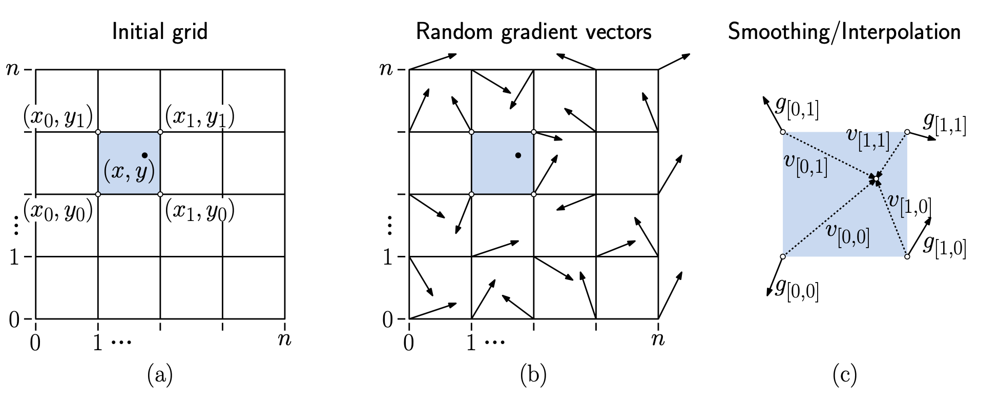
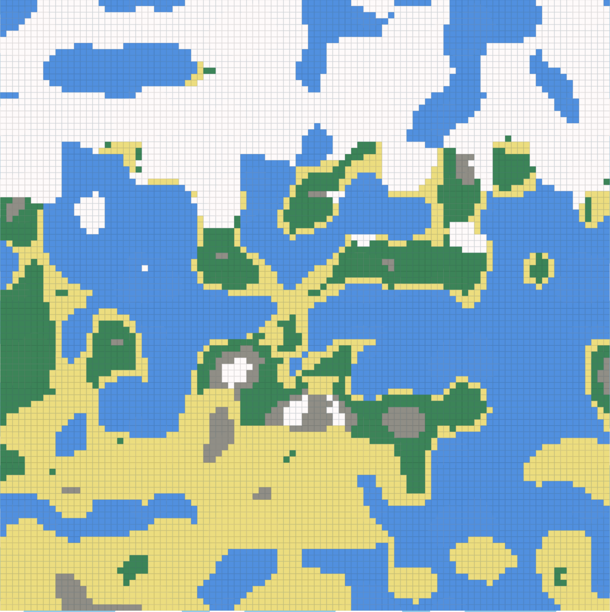
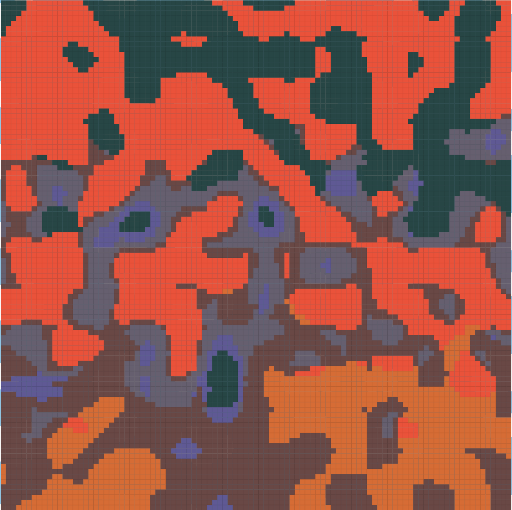
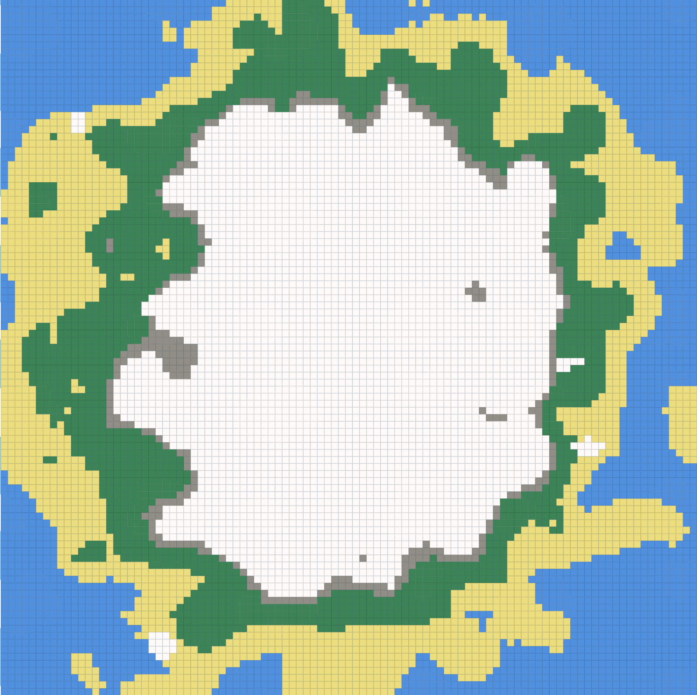
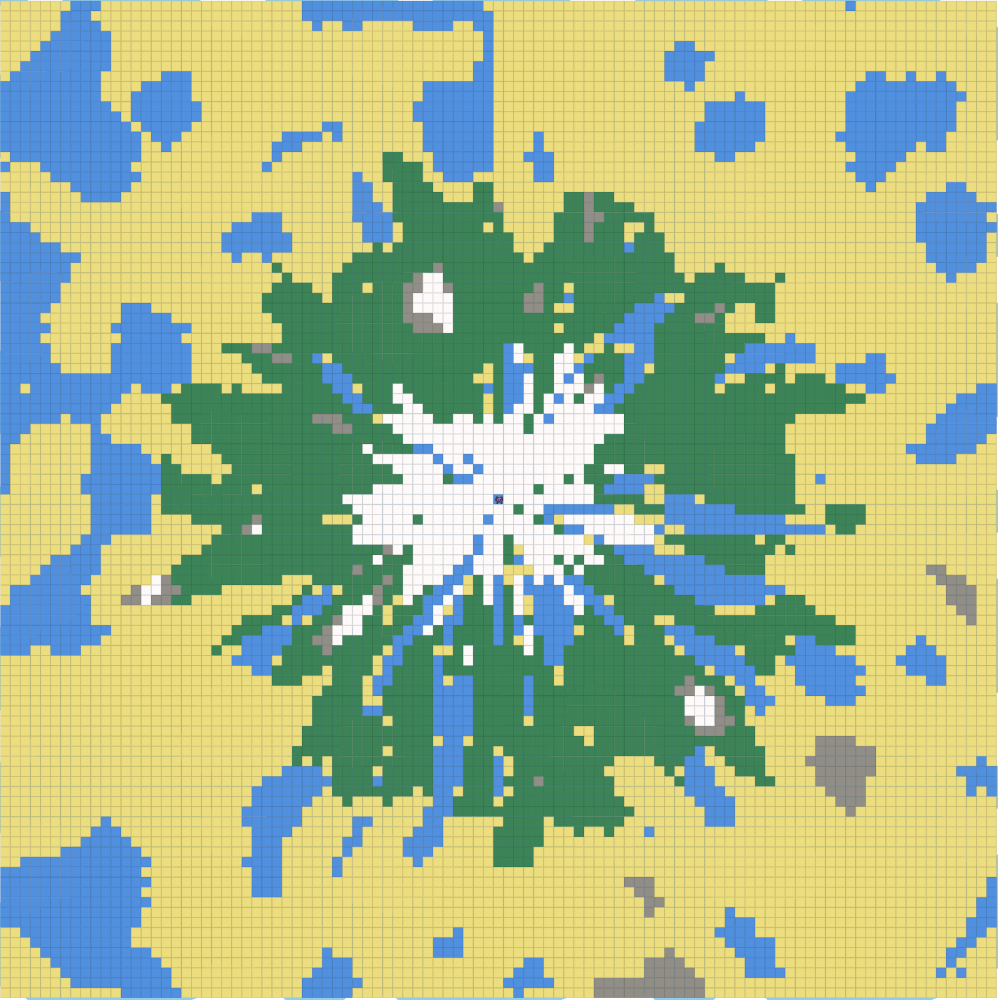
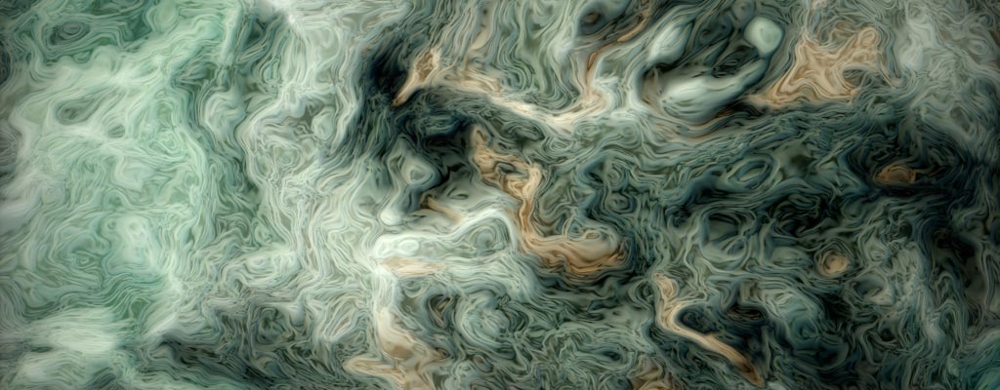
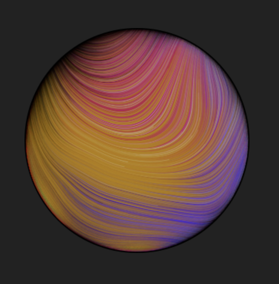
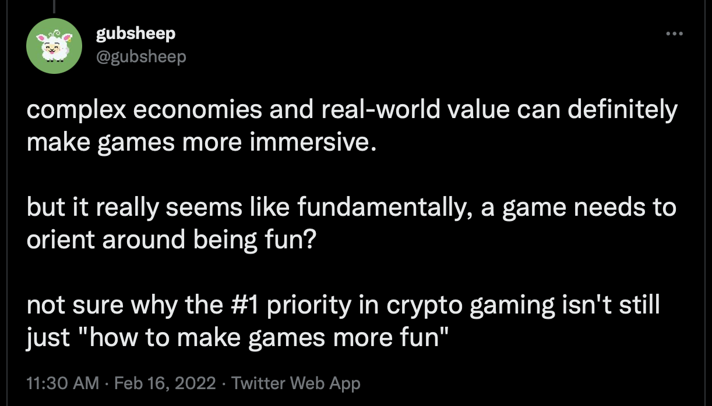
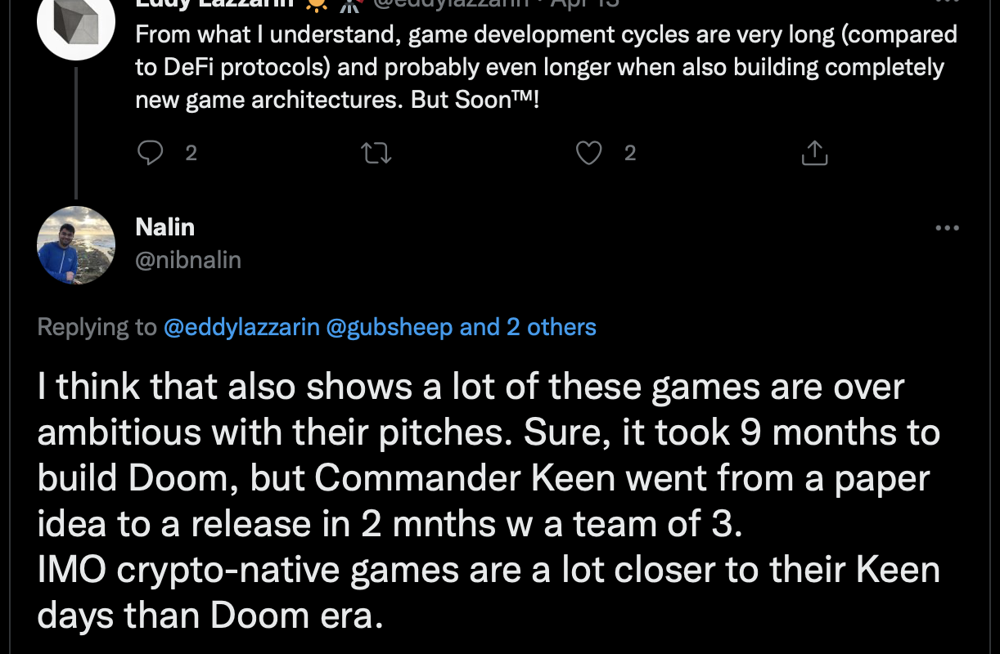

0xPARC is perhaps most well known for its contributions in applied ZK research, with projects surrounding ZK identity primitives in particular. But another, perhaps less well-known, branch of the 0xPARC community are world-builders. With games and systems like [Dark Forest](https://zkga.me), [Lattice (Ember)](https://twitter.com/latticexyz) and [exgrasia](https://twitter.com/exgrasia), many of us have been exploring novel visions for what on-chain, crypto-native gaming looks like. In this post, we’ll talk about one of the coolest primitives used by all three of the aforementioned games: procedural generation.

Procedural generation is the idea to create worlds (landscapes, dungeons, castles, clouds…) programmatically by the use of generation algorithms. Procedural generation algorithms typically attempt to emulate natural world formation processes, embedding variety and realism in the pseudorandomness of their outputs.

# Why procgen?

Your first instinct as a game developer might be to make maps block by block - by hand. Off chain, handmade maps are extremely commonplace - games like DayZ and Fortnite carefully engineer detailed towns and hills optimizing for maximum _fun_.

On-chain, however, we deal with a big constraint - storage cost. If you were to store a 1000x1000 grid world on Ethereum (of uint256s), for instance, it would cost you X gas (which amounts to ~$Y on mainnet today). Instead the use of procedural generation allows you to generate each of these tiles on-demand, only costing money when a player first steps on a particular coordinate for instance. Each individual call to a procedural generation algorithm (perlin noise, for instance) is also significantly cheaper, costing less than A gas (~$B). By running procedural generation and caching a tile’s attributes when someone first steps on it, you can amortize the cost of storing the map on-chain amongst all the players of your world. In some sense, a procedural generation algorithm is a trick to compress a complex world into an executable.

Procedural generation isn’t a new idea specific to onchain gaming! All your favourite roguelike games use procedural generation in some way or the other, including minecraft (for landscape generation), No Man’s Sky (for planet generation) and Dwarf Fortress (for creatures, religions etc.) among [many others](https://en.wikipedia.org/wiki/List_of_games_using_procedural_generation).

Procedural generation for world building is, unsurprisingly, a technique originally pioneered by games running on 16kb RAM and 1mhz processors back in the 90s. It’s interesting how many similarities there are between the resource-limited personal computers of the 90s and the resource-limited shared computer today that is Ethereum. In many ways, we’re in the 90s of crypto-native gaming, and developing an on chain world right now is an exercise in balancing constrained creativity and being resourceful and hacky with what’s possible with on-chain compute.

# How procgen?

So far, we’ve only considered procedural generation in hand wavy terms - “make me a cool looking world”. One layer deeper, however, what we mean is that we want a source of entropy that feels random, but also isn’t chaotic to look at. More formally, our aim is to create some sort of a noise function that is variant when looked at globally, but locally consistent zooming in. To understand the intuition to making such a function, let’s start with something fundamental: sine waves! As a quick refresher, a sine wave is an equation that looks like $$y = amplitude * sin(x * frequency)$$. Amplitude and Frequency parameters allow you to squish or stretch the wave horizontally and vertically.

Another interesting concept is super-position: the ability to add up different wave functions. See what happens when we add up many sine waves with random parameters:

We get a lot more variation in our output globally, while maintaining the local similarity property we desired. This is how procedural generation works! Formally, each of the constituent waves is called an “octave”[^1], each adding more complexity to the surface of the output.

[^1]: There’s some connection between these octaves and the music theory octaves, but it’s unclear to the author what that is

Instead of using a sine wave, Perlin Noise uses a different function. While it follows the same idea, it's less regular compared to sine waves and its amplitude is more consistent. While it is technically possible to build all the generations we describe below with simple trigonometric functions like sine waves, Perlin noise is easier (and prettier) to use, so we’ll focus on Perlin Noise going forward.

## How does Perlin noise work?

Before we start exploring worldly Perlin structures, we’ll introduce one more idea of procedural generation: dimensionality. In the previous section, we’ve only worked with one dimensional waves — how can we extend this idea to 2D maps (or for that matter, N-dimensions)? Primarily, we now have to maintain the notion of regularity across not just one, but two dimensions.

The core idea of Perlin can be summarised as follows: take your 2D grid and break it into chunks (of say, size 5 x 5). Next, put random vectors at the corners of each chunk. Next, to compute the noise function at any (x, y) coordinate, obtain the random vectors at the corners of the chunk, and interpolate between them - this is just a fancy way of saying “compute a smoothened value that translates between the random vectors at the corners” using some calculus. There are some tricks to making a clean/clever interpolation between the vectors, but those are not particularly important for this discussion.

  
  

  <i>Credits: <a href="https://www.cs.umd.edu/class/spring2018/cmsc425/Lects/lect13-2d-perlin.pdf">UMD CMSC 425</a></i>
  

## Creative world building with Perlin Noise

[gubsheep fills jump from one octave greyscale to land water]

Now that we have a simple landscape resembling some sort of archipelago, let’s look at ideas that bridge this to more interesting world maps. For starters, what if we built something resembling our own world - with a North Pole at the top and more tropical/equatorial regions as me move downward from the Pole. We already have a notion of height of a tile. We essentially want to add a temperature parameter to our tile, one that while being somewhat random, follows the pattern we observe in the real world. To imbue this pattern, we’ll cleverly super position perlin output with a simple linear function of our own:



temperature += Math.floor((coords.x - 50) / 2);



By taking our old sine-wave-esque function and adding a linear function to it, we can retain the rough pattern we desired, along with the realistic landscape features. Now, we can use this temperature value in conjunction with height to switch tile types:



seedToTileType = (coords: WorldCoords, perlin1: number, perlin2: number): TileType => {
  const height = perlin1;
  let temperature = perlin2;
  temperature += Math.floor((coords.x - 50) / 2);

  let altitudeType = AltitudeType.SEA;
  if (height > 37) {
    altitudeType = AltitudeType.MOUNTAIN;
  } else if (height > 32) {
    altitudeType = AltitudeType.LAND;
  } else if (height > 30) {
    altitudeType = AltitudeType.BEACH;
  }

  let temperatureType = TemperatureType.COLD;
  if (temperature > 42) {
    temperatureType = TemperatureType.HOT;
  } else if (temperature > 22) {
    temperatureType = TemperatureType.NORMAL;
  }

  let tileType = TileType.UNKNOWN;

  if (temperatureType === TemperatureType.COLD) {
    if (altitudeType === AltitudeType.MOUNTAINTOP) {
      tileType = TileType.SNOW;
    } else if (altitudeType === AltitudeType.MOUNTAIN) {
      tileType = TileType.SNOW;
    } else {
      tileType = TileType.WATER;
    }
  } else if (temperatureType === TemperatureType.NORMAL) {
    // put less snow
  } else {
    // do something else (no snow)
  }

  return tileType;
};



With this set of patches, we obtain this nice, earthly map:

  
  

  <i><a href="https://github.com/nalinbhardwaj/devconnect-procgen-workshop/tree/part2-2">Code</a>. Notably, this is also the exact map used by <a href="http://exgrasia.xyz">exgrasia</a></i>
  

Interestingly, its also really simple to derive new maps by just being creative with color schemes and perceptions. This exact map with some changes can be seen as a Minecraft nether-like map, for instance:

  
  

  <i><a href="https://github.com/nalinbhardwaj/devconnect-procgen-workshop/tree/nether">Code</a></i>
  

To create these previous two maps, we’ve used plain $$x$$ coordinates to imbue a cool property to our procedurally generated temperature value. What if we assigned temperature based on distance from centre of the map? Let’s try it:

  
  

  <i><a href="https://github.com/nalinbhardwaj/devconnect-procgen-workshop/tree/island">Code</a></i>
  

We obtain an island with a mountain at the centre surrounded by snowy lands and a beach at the edges. And perhaps, if you run with imagination, it looks like the snowy area is a sideways portrait of a smiling ghost.

Let’s take this idea one step further. Instead of thinking about our map in a Cartesian plane, what if we look at it in a polar coordinate system? As a quick reminder, polar coordinate systems demarcate points by their distance from the origin and the angle between the line from origin to the point with the x axis. Here’s what happens if we use this coordinate system as the basis of generation:

  
  

  <i><a href="https://github.com/nalinbhardwaj/devconnect-procgen-workshop/tree/amsterdam">Code</a></i>
  

We obtain a map with much more radial symmetry. This is not surprising - we’ve essentially unrolled a rectangular map into a series of concentric rings to obtain this map! Perhaps this map is also somewhat reminiscent of the city where this year’s Devconnect was hosted, Amsterdam, a city built around concentric rings of buildings and canals.

### Putting worlds on-chain

So far, this blog has focused on the use cases for Perlin noise and procedural generation but all the described generations have accompanying solidity implementations - if you checkout the linked branches locally and right click any tile, you should see console logs verifying the generated tile types between the solidity and javascript versions - and you can find the generating code in [eth/contracts/TinyWorld.sol](https://github.com/nalinbhardwaj/devconnect-procgen-workshop/blob/master/eth/contracts/TinyWorld.sol#L29). Thanks to the DarkForest team, there’s also a [ZK circuit that can compute and verify Perlin Noise generations](https://github.com/darkforest-eth/circuits/tree/master/perlin) that may be relevant to readers.

## Whackier ideas

As you explore the world of procedural generation further, here's some of my own favourite advanced uses of procedural generation:

- [Fractal Brownian motion](https://iquilezles.org/articles/warp/): The creation of maps that recursively use the output of Perlin Noise to create more noise - kind of like taking the aforementioned rectangular/polar coordinate systems described in our Amsterdam exploration and replacing those by a coordinate system itself defined by Perlin Noise.

  

- [Perlin Planets](https://www.dannyking.uk/artwork/colororbs): The creation of force fields to make continuous spherical maps is super neat!

  

- [Volumetric clouds](https://www.diva-portal.org/smash/get/diva2:1223894/FULLTEXT01.pdf): Creating convincing looking moving cloud skyscapes efficiently is a hard task! While there's a lot of (noisy) details to the complete generation method, it, too, builds on Perlin Noise!

# Where procgen?

It’s funny how on the one hand crypto-native games feel like this unscratched surface with seething potential to change how we think about games at all, and yet, these are such early days that some of the best on-chain games right now only require algorithms simple enough to describe in blogs like this one. Constraints breed creativity, and we hope this blog inspires you to go explore affordances of the blockchain by building your own crypto native game - regardless of how _basic_ it might feel. Perhaps the biggest trap right now amongst crypto-native gaming devs is to fall into the trap of being over ambitious running L1s for land NFTs and tokenomics and what not. KISS.

  

  

# Credits

If this interested you, you may also find it interesting to explore and build tile contracts on top of exgrasia, which started with explorations of this on-chain procedural generation!

This is a more polished version of a talk gubsheep and Nalin gave at [DEFCON](https://defcon.0xparc.org). The [solidity implementation](https://github.com/nalinbhardwaj/exgrasia/blob/master/eth/contracts/Perlin.sol) of Perlin Noise was originally written by gubsheep, and the [zk-SNARK circuit implementation](https://github.com/darkforest-eth/circuits/tree/master/perlin) was written by the Dark Forest team. Thanks to [Yush](https://twitter.com/yush_g), with whom the first explorations of the exgrasia landscape were made and to [Alan Luo](https://twitter.com/alanluo_0) for introducing the Dark Forest team (and us!) to the magic of procedural generation on-chain.
