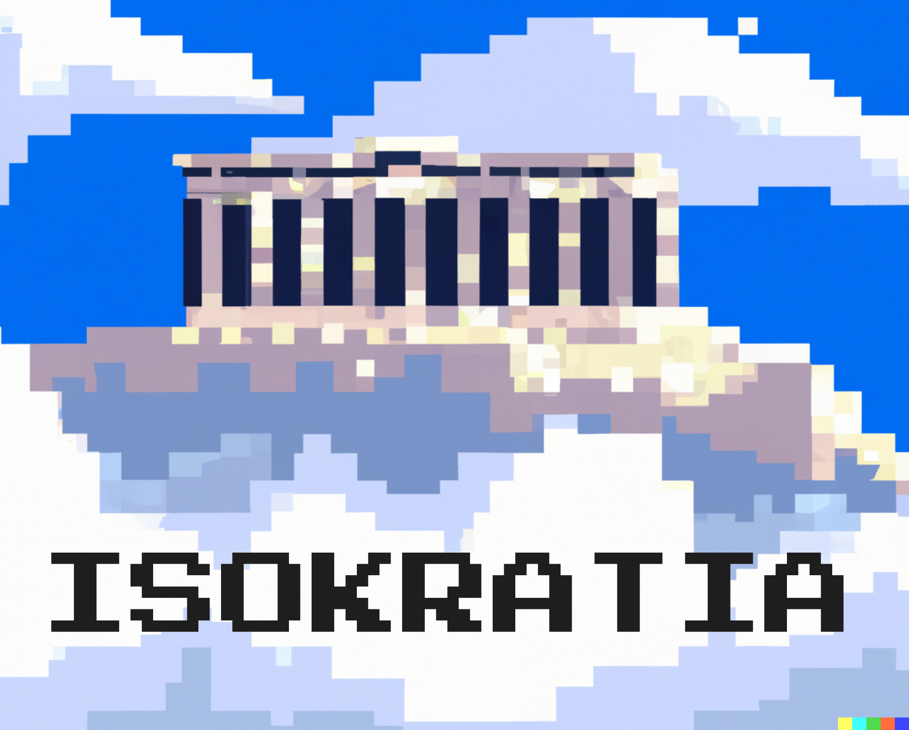
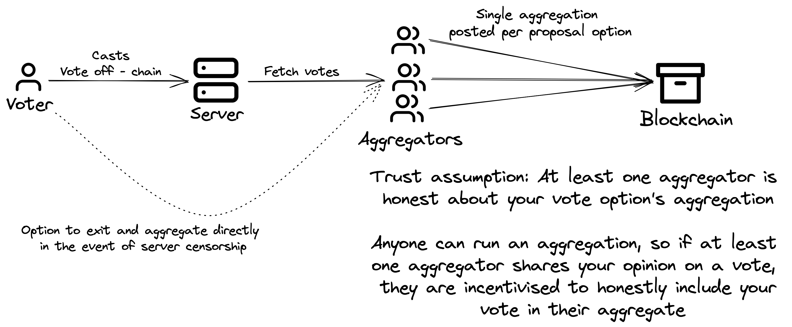

*By [Nalin](https://twitter.com/nibnalin). Isokratia was developed in collaboration with [lermchair](https://twitter.com/lermchair) (frontend!).*

In this blog post, we’re excited to present an application uniquely enabled by recursive SNARKs — Isokratia, a trust minimized governance platform with off-chain (free) voting.

<video controls autoPlay>
  <source
    src="/assets/isokratia/demo.mp4"
    type="video/mp4"
  />
</video>

# Live demo at [isokratia.xyz](https://isokratia.xyz/)

Isokratia uses recursive SNARKs to enable trust-minimized governance for off-chain voting platforms.

Note that for now, **we only intend for Isokratia to be a proof of concept for what's possible. None of our code is audited or recommended for production use without serious considerations.** At the very least, the circuits require a trusted setup ceremony and proper auditing (if not formal verification) before production use.

## Why?

To motivate the use case and construction of Isokratia, consider how governance platforms today work:

On one hand, you have platforms like [Snapshot Labs](https://snapshot.org/#/) that run entirely off-chain (making it free to vote for voters) and decisions are then enacted upon by the DAO's core team/multisig (on-chain or otherwise). In this construction, voters not only trust Snapshot Nodes to be honest and censorship-resistant, but also the DAO's multisig executors to be honest.

On the other hand, you have platforms like [Compound Governance/GovernorBravo](https://compound.finance/governance) which run entirely on-chain, eliminating almost all intermediary trust assumptions but then cost voters gas fees for participation (and thus often end up reducing participation).

Isokratia achieves the best of both worlds: ~free and secure! Voters vote off-chain for free and aggregators "roll up" the votes into a succinct recursive SNARK proof. This aggregation only costs ~500k gas to verify \~infinite[^1] votes on-chain! Simultaneously, voters make minimal trust assumptions. Anyone can run an aggregator, and aggregator incentives align such that even if there is one aggregator holding each of the voting opinions, the entire voting aggregation will be uncensored and honest. Additionally, using the chain as the source of truth also enables Isokratia to inherit the censorship-resistance properties of the chain: Voters have the option to exit and vote directly in the event the server censors them. We will expand upon these trust assumptions in the next section.

Another way to view this construction is as a layer 2 rollup. This is quite an interesting perspective because most rollups base their security on monetary incentives. In the case of Isokratia, however, the incentivisation is pushed down to the individual polls: If even one person cares about a particular poll, there will be an honest aggregation and polling. This is quite unlike financially secured rollups, and perhaps, can inspire other rollup applications where monetary incentives do not exist (or are hard to instrument).

[^1]: There is a constant limit set to \~4 million votes currently, but the cost of increasing this limit grows logarithmically, so it is relatively easy to increase for any practical applications.

## How?

Let's start with the high level architecture of Isokratia:

In the happy path, the user experience of creating a new proposal and voting on proposals is pretty much the same as other off-chain voting platforms like Snapshot! Creating a new proposal additionally requires an on-chain transaction to replicate the proposal on-chain for aggregation. As ECDSA signatures verifying votes stream in to the server, aggregator nodes query the backend for new votes and continually generate larger and larger aggregations of the votes. Then, finally, they submit these aggregation proofs on-chain to settle the vote!

Now, let's consider the trust assumptions at each step more deeply, starting with the server. User signatures are used to authenticate votes, so the server cannot lie about votes, but it may censor voters. In this event, users have the option to exit by simply directly submitting their votes to an aggregating node (or run one themselves). This almost dispenses the server's role to a convenient hub for off-chain data availability. While not implemented by Isokratia for simplicity, an alternate construction to prevent server censorship might be to construct a registry on-chain and let each voter self-host their votes (much like Farcaster's [sufficiently decentralised](https://www.varunsrinivasan.com//2022/01/11/sufficient-decentralization-for-social-networks) thesis). Another way to view this intermediate server instead is as a [volition](https://medium.com/starkware/volition-and-the-emerging-data-availability-spectrum-87e8bfa09bb) with on-chain validity proofs.

Now, consider the trust assumption on aggregators if the server is assumed to be honest. If the aggregator is not neutral to a vote, they may choose to not include votes they do not like in their aggregations. However, if even one aggregator is aligned with a voting option, they are directly incentivised to put _all_ votes for that option in their aggregation on-chain. This makes the trust assumption 1-of-N style: If at least one of the N voters who chose a particular option for a proposal run an aggregation, all votes for that option should be posted on-chain uncensored. Additionally, in practice, one can imagine the DAO team/multisig holders will usually run their own neutral aggregation node as well, making the system quite robust in practice.

Now that we have the basic setup of the system in mind, let's dig into the SNARK circuit used for aggregation:

## Recursive SNARK construction

SNARKs are used to compress votes into a single aggregate proof. At a high level, this proof shows that a subset of eligible voters voted for a particular option. To do so, it recursively breaks down the verification into two parts:

- One of the voters in the set, let's call them the singleton, voted for a particular option
- The circuit correctly verified another SNARK proof saying that the set minus the singleton voted for the same option.

Let's build up the setup for each of these two parts:

### The singleton

How do we verify even just one vote inside a SNARK? First, we'll need to define some notion of who is eligible to vote. Typically, this will be the set of people who own an ERC-20 token or an ERC-721 NFT. During the creation of the proposal, the creator will take a snapshot of this set of people and post a vector commitment of them. Let's call this vector commitment the eligibility merkle tree. Then, inside a SNARK, we'll need to do 2 checks:

1. The voter's address belongs to the eligibility merkle tree. This will be done by a merkle opening proof inside the SNARK.
2. The voter ECDSA-signed a message saying "I vote {insert vote option} for proposal {insert proposal ID}".

With this context, you'll note that our overall circuit is actually just an ECDSA signature aggregation circuit with a some set membership checks.

### From singleton to sets

Checking a single vote is simple, but here comes the hard part: how do we extend these checks to work with sets of voters _across_ recursive proofs while counting the size of the set. We need to deal with two complex problems:

- We must not allow the aggregation to be able to repeat the same vote twice and double-count it.
- We can't just pass the entirety of the set in plain text to the circuit. So we need to pass around a succinct representation of it.

Therefore, we need a vector commitment scheme that supports the ability to efficiently "delete" elements from the vector. Conveniently, Merkle trees support this if we just introduce the notion of NULL values to the tree leafs.

How exactly does this work? First, let's construct a modification of the eligibility merkle tree. The leafs of the eligibility merkle tree are addresses that are eligible to vote, and the votes we're aggregating are from a subset of the eligible addresses, so let's make a merkle tree where all the leafs outside of the set of voters are set to NULL. So, for instance, an eligibility merkle tree's leafs might look like `[nibnalin.eth, vitalik.eth, alice.eth, bob.eth, charlie.eth]` and the leafs of a voter tree corresponding to this eligiblity merkle tree could look like `[nibnalin.eth, NULL, alice.eth, NULL, NULL]`. We'll see why it's important to NULL-pad this way later.

Then, let's formalise the statement our recursive circuit proves: "I prove everyone in the voter merkle tree has voted for a particular option". Now, our recursive circuit proceeds like this at each layer:

1. Prove that a singleton voted correctly
2. Delete the singleton's leaf in the voter merkle tree by replacing it with a NULL, call this the *modded* voter merkle tree.
3. Prove that I can verify another SNARK proof saying "I prove everyone in the *modded* voter tree root has voted for a particular option"

Continuing our example from before where the eligibility merkle tree leafs were `[nibnalin.eth, vitalik.eth, alice.eth, bob.eth, charlie.eth]` and the voter merkle tree leafs were `[nibnalin.eth, NULL, alice.eth, NULL, NULL]`, the first layer of recursion could verify a vote from `nibnalin.eth`, and delete `nibnalin.eth` from the leafs to obtain the *modded* voter tree with leafs: `[NULL, NULL, alice.eth, NULL, NULL]`. This circuit would then verify another proof saying "I prove everyone in the modded voter tree (`[NULL, NULL, alice.eth, NULL, NULL]`) has voted YES" and this would recurse down until all the leafs are `NULL`.

*A diagram walking through this example. To read this, start at the top left, and move to the bottom right anticlockwise.*

Now that our aggregation circuit is clearer, notice that the aggregator cannot double count votes in this scheme because once counted, the leaf gets replaced by a NULL value in the next layer of recursion. Since no addresses are repeated in the eligibility merkle tree, no votes can be repeated in the aggregation. Secondly, this scheme is very composable and streamable. In particular, if I have a proof for the leafs `[nibnalin.eth, NULL, alice.eth, NULL, NULL]` voting (as above) and then `vitalik.eth` also casts a vote, we can re-use the previous proof as the inner proof for the circuit verifying voter tree `[nibnalin.eth, vitalik.eth, alice.eth, NULL, NULL]` out of the box.

For the curious, replacements in a merkle tree are quite simple to support: Much like a path proof, replacing a leaf's value only impacts hash values along the path from the leaf to the root. So, much like a [segment tree point update](https://codeforces.com/blog/entry/15729), we can traverse this path and only need to recompute hashes along this path in O(log N) cost. 

This may seem like a rather complicated concoction on the surface, but it is relatively straightforward to implement and perhaps the only solution I could think of that would be composable and cheap. I'd be curious to hear other ideas for this structuring.

### Offloading checks outside

Note that merkle trees in the above construction can be replaced by any vector commitments that allow for efficient replacements inside a SNARK. It is worth noting that this vector commitment trick points to a general shortcoming/note on designing efficient recursive SNARKs: Often, developers will expose data as public inputs and offload checks and computations on that public input to the "outside the SNARK" environment. For instance, you might want to check an ECDSA signature is signed correctly for a message inside a SNARK. If the message itself contains no sensitive data, you would just run checks on the message outside the SNARK (for instance if it is indeed equal to keccak hash of your smart contract's requirement).

While that pattern works nicely for non-recursive SNARKs, for recursive SNARKs it becomes problematic as you essentially need to _unroll_ the entirety of the "inner" SNARKs outside the outermost SNARK to be able to access their inputs/checks in a non-SNARK environment. If you do so, you end up stacking up the number of public inputs with each iteration, so it essentially never makes sense to offload computation outside the SNARK: you should either make all checks inside the SNARK or come up with a method to aggregate the necessary checks into a constants number of outputs with each recursion level.

Ultimately, this bag of tricks from semi-public inputs to vector commitments as vote carrying data structures enables us to build an aggregation circuit for ECDSA signatures in general, and apply it to Isokratia as a voting compression tool.

The server and smart contracts are much less exotic. The client is a simple Next.js frontend (designed and built by [lermchair](https://twitter.com/lermchair)!) and the backend uses Next's serverless APIs with a PlanetScale DB. Smart contracts were written with tests and deploy scripts using the Foundry toolkit.

### Future ideas

**Weighted voting**: Currently, Isokratia is implemented as a proof-of-concept that only supports 1 address = 1 vote strategies. The client allows you to start a new vote for any Merkle tree generated from a mainnet NFT contract address. In future, it'd be useful to add in other strategies such as weighted voting. To do so, you can simply use another merkle tree containing weights corresponding to eligible voters and sum them in the aggregation proof.

We also observed that some strategies are hard to adapt to this Isokratia-like system. For instance, ranked choice voting might be hard to support given the almost exponential number of options and as a result, a split of trust amongst the aggregating nodes. I'd be curious if folks have thoughts on the trust assumptions achievable for these sort of voting strategies.

**Dark pools**: We previously mentioned that users have the option to exit in the event of censorship. In fact, this exit option can be used to enable more interesting interactions beyond just censorship prevention. Users can group together and use this exit mechanism to create "dark pools" of votes where they all directly submit their votes to an aggregator and in the process, hide their votes from everyone else (with the anonymity set of the group). This dark pool construction, however, would require trusting the aggregator node.

**Fully Autonomous Governance**: As we previously discussed, governance platforms like Snapshot Labs often rely on intermediaries such as the DAO's core team/multisig holders to execute upon polls. They essentially serve as trusted oracles that bridge external votes to the blockchain. In the case of Isokratia, however, since aggregators directly post votes on-chain, the Isokratia smart contract is already a trust-minimized source-of-truth for the voting results on-chain. This means that for many use cases, we can remove the dependency on DAO core teams and instead set up automatic execution based on voting results. This can also be used in conjunction with tools like [The Keep3r Network](https://keep3r.network) to instrument more complex follow through actions. I'd be curious to see cool integrations of Isokratia's voting mechanism for autonomous governance.

If you would like to run your own aggregation node, check out [USAGE.md](https://github.com/nalinbhardwaj/isokratia/blob/main/USAGE.md) in the repository.

We also made an attempt to fork the MIT-licensed code of Snapshot Labs and bake in this mechanism into their client/node software. While it's certainly doable, we found it prohibitively hard to do so for a proof of concept. If you identify as Snapshot Labs (or another open-source governance platform) and are interested in integrating the Isokratia mechanism into your platform, hit us up!

*Thanks to lermchair for helping build the frontend of Isokratia, and to Jonathan Wang and the [circom-pairing](https://github.com/yi-sun/circom-pairing) team for building pairing checks and helping build the groth16 verifier in Circom. Thanks also to Adhyyan Sekhsaria, Yi Sun, Amir Bolous, DC Posch, gubsheep and everyone else in the 0xPARC community for support in all forms: discussion, ideation and reviews of this blog post! The Isokratia cover image is an edit of an image generated using DALL-E, so the copyright on that belongs to OpenAI.*